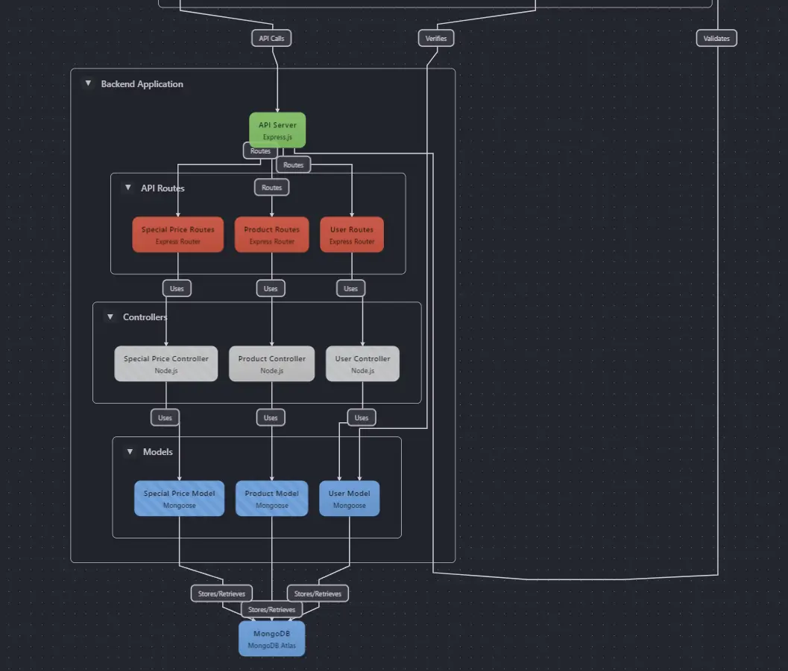

# back End

### introduccion

Proyecto tipo tienda con productos, precios especiales y usuarios.
API Requests: Se usa [Axios/Fetch] para realizar llamadas al backend de manera eficiente.

> Iniciar proyecto.
>
> > npm install.
> > node app.
>
> - Repositorio Back: https://github.com/brayang222/drenvio-BackEnd
> - Despliegue Back: https://drenvio-back-end.vercel.app/

